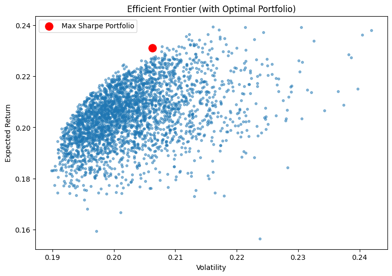

# Portfolio Optimization using Modern Portfolio Theory (Markowitz)

This project performs portfolio optimization on selected Indian stocks using 
Modern Portfolio Theory. It constructs an efficient frontier, identifies the 
maximum Sharpe ratio portfolio, and analyzes risk vs return characteristics.

---

## 📌 Objective
- Fetch historical price data
- Compute returns & covariance
- Generate random portfolios
- Plot Efficient Frontier
- Identify Max Sharpe Portfolio
- Compare asset allocations

---

## 🧾 Data
Stocks included:
- RELIANCE.NS
- HDFCBANK.NS
- ICICIBANK.NS
- INFY.NS
- TCS.NS
- LT.NS

Historical data fetched from Yahoo Finance (2019–2025).

---

## 📊 Results

### 🔺 Optimal Portfolio Allocation
| Stock | Weight |
|-------|--------|
| INFY.NS | 32.25% |
| ICICIBANK.NS | 26.97% |
| LT.NS | 16.61% |
| TCS.NS | 13.92% |
| RELIANCE.NS | 10.26% |
| HDFCBANK.NS | 0.00% |

### 📈 Performance
- Expected Return: **~23.1%**
- Volatility: **~20.6%**
- Sharpe Ratio: **~1.12**

The optimizer assigns highest weights to **Infosys & ICICI Bank**, indicating
strong historical risk-adjusted returns, while **HDFC Bank receives zero weight**
due to weaker contribution to portfolio efficiency.

---

## 🖼️ Visualization
Efficient Frontier with highlighted optimal portfolio:

---

## 🛠️ Tech Stack
- Python
- Pandas
- NumPy
- Matplotlib
- SciPy
- yFinance

---

## 🚀 Future Improvements
- Add Minimum Variance Portfolio
- Add Risk-free rate
- Backtesting
- Streamlit dashboard UI

---

## 📌 Author
Jaywardhan Raghu
